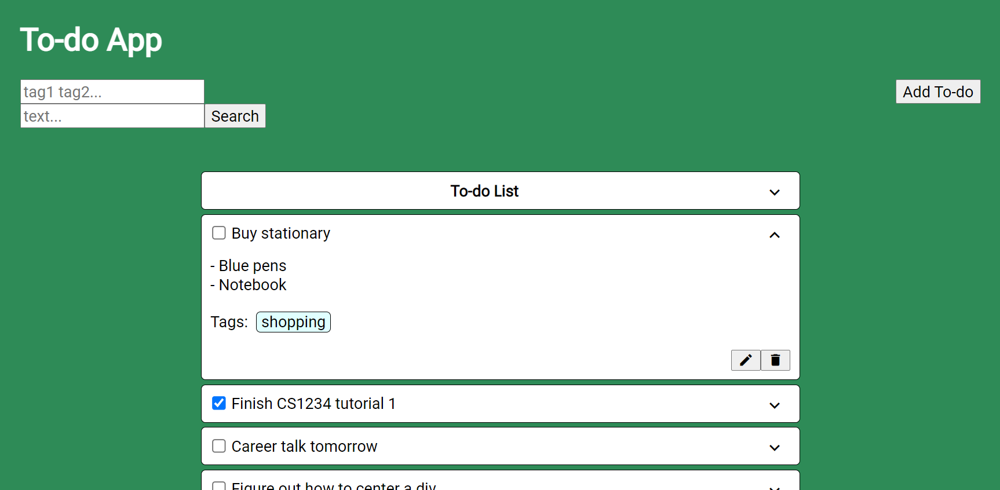

# CVWO To-do App
Name: Tai Tze Kin  
Matriculation Number: A0233177E



A task management web application built with a frontend in React and a REST API backend in Rails.

A user manual for the app can be found [here](submissions/final/TaiTzeKin_A0233177E_FinalWriteup.pdf).

## Visit the app online
The app has been deployed on Heroku at https://desolate-escarpment-14952.herokuapp.com.

## Run the app locally
To run the app locally, you will need to have the following installed on your machine:
- Rails
- PostgreSQL
- Yarn

Clone this repo and move into the directory:
```
$ git clone https://github.com/teekaytai/cvwo-to-do-app.git
$ cd cvwo-to-do-app
```

Install the necessary Ruby gems and JavaScript dependencies:
```
$ bundle install
$ yarn install
```

Migrate the database:
```
$ rails db:migrate
```

Finally, start the local server:
```
$ rails s
```
You can now navigate to `localhost:3000` in a web browser to view the app.